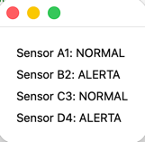

# Sensor Monitor 
A small desktop app that reads sensor data from a CSV file and displays alerts. 

## What it does 
 It handles a Sensor class, reads a CSV file, processes the data, and finally shows a window with the results. 



## Requirements
 Python 3.x, PySide6 

## How to run

```bash
pip install -r requirements.txt
python pipeline_data.py
```

## How it works 
First, the program reads the CSV file to obtain the values, then it creates Sensor objects with a few loops, then processes the lines through the "alerta" method in the class, and finally it displays the data in a window using PySide6
## What I've learned

* Handling BOM in files with encoding
* PySide6 Basics
* Data Casting
* Parsing data
* Reusability
* Classes and Structure